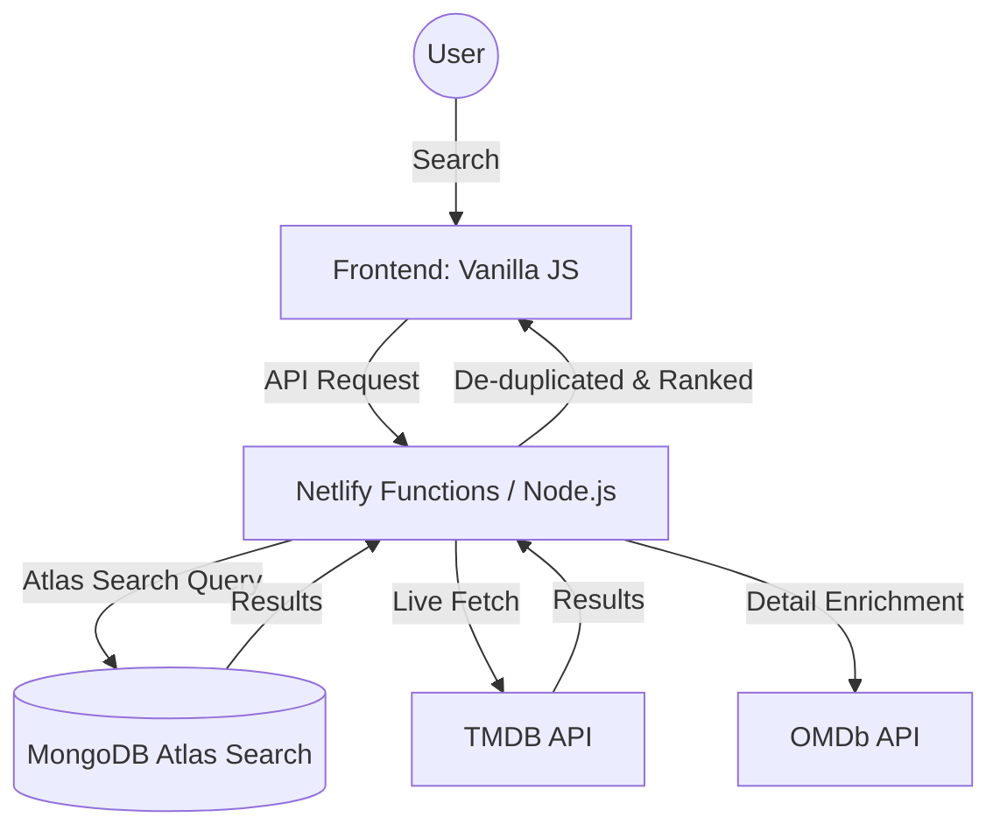

# 🎞️ MongoMatch: Premium Hybrid Movie Search Engine

[](https://app.netlify.com/sites/mongomatch-atlas/deploys)


**MongoMatch** is a production-grade movie discovery platform that combines the historical depth of **MongoDB Atlas Search** with the real-time freshness of **TMDB** and **OMDb** APIs. 

Built with a "Hybrid Architecture," it ensures you can find everything from 1920s classics to movies released in cinemas today.

---

## 🚀 Key Features

### 🔍 **Master Scoring Search Engine**
- **Fuzzy Matching**: Resilient to typos (e.g., search "Batmain" to find *Batman*).
- **Compound Relevance Formula**: Ranks results using `Search Score * (Rating + log10(Votes))`. Popular and high-quality movies always appear first.
- **Multi-Field Matching**: Search by **Title**, **Plot**, **Cast**, or **Director**.
- **Dynamic Filtering**: Advanced filtering by Genre and Year Range, synced across both the database and live APIs.

### ⚡ **Premium Search-as-you-Type**
- **Rich Autocomplete**: Instant suggestions with poster thumbnails, IMDb ratings, and genre tags.
- **Keyboard Navigation**: Full support for arrow keys (`↑ ↓`), `Enter` to select, and `Esc` to close.
- **AbortController**: Intelligent request handling prevents "stale" results from appearing when typing fast.

### 📽️ **Rich Movie Experience**
- **Live Data Enrichment**: Fetches real-time Box Office, Awards, Metascore, and Cast details from OMDb on the fly.
- **Hybrid Results**: Seamlessly merges results from the local Atlas database and the global TMDB live feed.
- **Glassmorphism UI**: A modern, sleek interface with blur effects, shimmer loaders, and responsive layout.

---

## 🛠️ Technology Stack

- **Database**: MongoDB Atlas (Atlas Search, Lucene Engine)
- **Backend**: Node.js, Express.js (Serverless on Netlify)
- **Frontend**: Vanilla JavaScript (ES6+), CSS3 (Modern Flex/Grid/Glassmorphism)
- **APIs**: 
  - **TMDB API**: Live trending and movie data.
  - **OMDb API**: Metadata enrichment (Box Office, Awards).

---

## 🏗️ Technical Architecture



---

## 🏁 Quick Start

### 1. Prerequisites
- Node.js (v14+)
- A MongoDB Atlas Cluster (with the `sample_mflix` dataset)
- API keys for [TMDB](https://www.themoviedb.org/settings/api) and [OMDb](http://www.omdbapi.com/apikey.aspx)

### 2. Installation
```bash
git clone https://github.com/your-username/MongoMatch.git
cd MongoMatch
npm install
```

### 3. Environment Setup
Create a `.env` file in the root directory:
```env
MONGODB_URI=your_mongodb_connection_string
DATABASE_NAME=sample_mflix
COLLECTION_NAME=movies
INDEX_NAME=default
TMDB_API_KEY=your_key
OMDB_API_KEY=your_key
```

### 4. Run Locally
```bash
npm run dev
```
Open `http://localhost:8080` to see it in action.

---

## 📄 License
This project is licensed under the **MIT License**. See the [LICENSE](LICENSE) file for details.

---

*Built with ❤️ by Hari & the Antigravity Team.*
